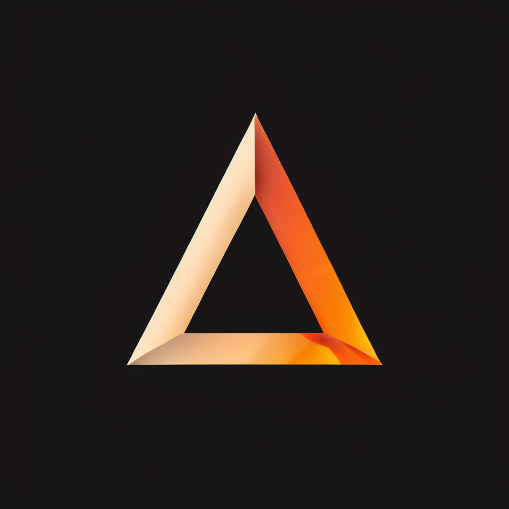

<div id="top"></div>

<!-- PROJECT LOGO -->
<br />
<div align="center">
  <a href="https://github.com/CreamMeatball/TrAiAngle/">
        
  </a>

  <h2 align="center">TrAiAngle</h2>

  <p align="center">
    Web service that uses Google's Mediapipe to determine whether home training movement is right or wrong and provide feedback on it.
  </p>
</div>

<!-- ABOUT THE PROJECT -->

### Built With

1. For data processing and model training

    - [Numpy](https://numpy.org/)
    - [Pandas](https://pandas.pydata.org/)
    - [Sklearn](https://scikit-learn.org/stable/)
    - [Keras](https://keras.io/)

2. For building website

    - [Vue.js v3](https://vuejs.org/)
    - [Django](https://www.djangoproject.com/)

<p align="right">(<a href="#top">back to top</a>)</p>

## Getting Started

This is an example of how you may give instructions on setting up the project locally.

#### Setting Up Environment

```
    Python 3.9.19
    Node 21.3.0
    NPM 10.2.4
    OS: MacOS (or Linux)
    (In Windows, There are commands that Windows does not support, such as rm and cp. And path settings for file I/O are also incompatible with Windows systems)
```

### Installation

1. Clone the repo and change directory to that folder

    ```sh
    git clone https://github.com/CreamMeatball/TrAiAngle.git
    ```

2. Create the Virtual Environment with Python 3.9.19 version.

   I create the Virtual Environment by using IDE PyCharm.
   
   Additionally, the pip version in python 3.9.19 Virtual Environment is 23.2.1
   
   And you should install Node and NPM.
   
   Node : 21.3.0
   
   NPM : 10.2.4

4. Install all project dependencies

    ```bash
    pip install -r requirements.txt
    ```
    Certain libraries must use the same version as specified in requirements.txt.

5. Move to 'web' directory by using command 'cd web' from root directory.

6. In 'web' directory, install Tools for Web Frontend

   ```
   npm run install:all
   ```

7. Create a directory for the resulting files to be stored.

   Create a folder
   
   - media : root/web/server/static/media
   - images : root/web/server/static/images
  
8. Migration

   In directory, 'root/web/server/',
   
   migrate with 'manage.py'.
   
   ```
   python manage.py migrate
   ```

9. Finally, run server and access the web.

   In directory, 'root/web',
   
   run the server with below command.
   
   ```
   npm run start:website
   ```

   Then you can access the web in url 'http://127.0.0.1:8000"
   

<p align="right">(<a href="#top">back to top</a>)</p>

<!-- USAGE EXAMPLES -->
<div id="Usage"></div>
<br/>

## Usage

After accessing the website, click the 'VIDEO UPLOAD' button.

Upload your Video first at left side,

(You can use demo video in 'root/demo')

and select the exercise type that corresponds to the exercise in the video.

Then press the 'Process!' button, and after a moment, you can see the result!

<p align="right">(<a href="#top">back to top</a>)</p>

<!-- LICENSE -->

## License

MIT License of the original author of the reference repository.

<p align="right">(<a href="#top">back to top</a>)</p>

<!-- ACKNOWLEDGMENTS -->

## Acknowledgments

This project was created by referring to and applying the below repository.

[Exercise-Correction](https://github.com/NgoQuocBao1010/Exercise-Correction)

There have been modifications to several libraries and codes for compatibility at this point in time.

<p align="right">(<a href="#top">back to top</a>)</p>
